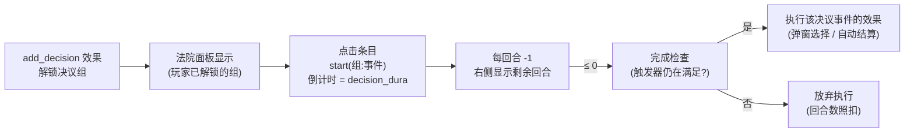

# 文明时代3 决议系统帮助文档

> 适用:内置 Team Rainfall「Polaris AoH3」框架(≥ 2.14)的模组 | 整理日期:2026-10-10
> 依据:游戏引擎反编译产物(`team.rainfall.rfEvent.*` 及相关事件类)、Team Rainfall 官方文档站(rf-library.aoh.moe)、模组实测数据
> 注:本工具与部分旧文档中出现的「决策」字样,与本文的「决议」指同一系统。

## 一、总览

决议系统由社区框架 **Rainfall Event(rfEvent,Team Rainfall 开发)** 提供,**原版游戏没有该功能**——需模组运行在 **Polaris AoH3 ≥ 2.14**(或内置同版本插件的整合包)上。

一句话原理:把「一个普通事件」包装成一个**需要若干回合完成的决议**——玩家(或 AI)在法院面板点击开始 → 每回合倒计时 → 倒计时结束后执行事件效果。

| 核心对象 | 说明 |
|---|---|
| **决议组** | 一组共享标题 / 图片 / 描述的可解锁决议(如「政治决策」),定义于 `rainfall/rfEvent_decision.json` |
| **决议事件** | 组内的一个具体条目 = 一个事件脚本(如 `决议:清洗`),承载「倒计时长度 + 可用条件 + 完成效果」 |
| **运行时键** | 「`组id:事件id`」复合键(如 `RUS:决议:清洗`),用于开始、查询进行状态 |

## 二、运作原理(生命周期)



1. **加载(惰性)**:进入游戏后**首次**用到决议时,框架才读取 `rainfall/rfEvent_decision.json` 并加载 `gfx/decision/` 下的组图片;文件缺失或出错不会阻止游戏启动。
2. **解锁**:事件效果 `add_decision=<组id>` 让文明拥有某决议组(组必须在定义文件里存在);`remove_decision=<组id>` 收回。解锁后框架自动刷新决议面板。
3. **显示**:打开**法院面板的任务页**时,列出玩家每个已解锁的组——组标题、组图片、组描述,以及组内所有**可用**的决议条目;每个条目显示事件标题,右侧显示「剩余回合数」或「Completed」(`only_once` 且已完成)。
4. **开始**:点击条目时先校验触发器(不满足会提示「RequirementsNotMet / 条件未满足」)→ 通过则开始倒计时,初值 = 事件脚本的 `decision_dura`。同一条目进行中不可重复开始。AI 文明由框架自动开始满足条件的决议(受 `rfEvent.json → aiDecision` 开关控制,默认开启)。
5. **推进**:每回合(回合处理阶段)倒计时 -1;期间可用触发器 `taking_decision` 判断某决议是否正在进行。
6. **完成**:倒计时归零时**再检查一次触发器**——仍满足(或已关闭 `decisionTwiceCheck`)则执行该决议事件;不满足则放弃,回合数不退还。执行时效果**只作用于发起决议的文明**。
7. **效果执行方式**(由事件脚本的 `run_in_background` 决定):
   - `run_in_background=true`:无需玩家操作,自动选中一个选项并执行(选项按 `ai` 权重;HC 模式优先 `historicChoice`);
   - `run_in_background=false`:玩家弹出事件窗,由玩家点选选项执行;AI 文明总是自动执行。
8. **存档**:决议进度(已解锁组、各条目剩余回合、当前显示的 desc / 图片索引)保存在**存档文件夹**内的 `DecisionData.json`,读档自动恢复,无需手工维护;开新游戏 / 载入剧本时自动重置。

## 三、资源结构

决议相关文件(其余 `rainfall/` 配置文件见《配置说明文档》):

```
<模组>/assets/
├── rainfall/
│   └── rfEvent_decision.json      # 决议组定义(唯一数据源)
├── gfx/
│   └── decision/                  # 决议组图片(与部分事件图共用该目录)
│       └── *.png
└── map/<地图>/scenarios/<剧本>/events/common/   # 决议事件脚本(放全局或剧本事件目录)
    └── 决议:xxx.txt
```

### 3.1 rfEvent_decision.json — 决议组定义

| 字段 | 类型 | 说明 |
|---|---|---|
| `id` | 文本 | 组 ID:用于 `add_decision` 解锁、组合成「组:事件」键;建议简短且唯一 |
| `name` | 文本 | 组标题(显示于面板;可写翻译键) |
| `desc` | 文本数组 | 组描述,**可多条**:第一条为初始;用效果 `decision_desc` 切换显示第几条(从 0 数) |
| `images` | 文本数组 | 组图片文件名(**含扩展名**,放 `gfx/decision/`),**可多条**:用效果 `decision_image` 切换(从 0 数) |
| `events` | 文本数组 | 组内决议事件 **id** 列表(= 事件脚本**内部 `id=` 行的值**;很多模组文件名与 id 不同,如 `chi改任改革派1.txt` 的 id 为 `改任维新派1`);每个对应一个可点击条目 |

实测示例(东欧危机 europe):

```json
{"decisions":[
  {"id":"RUS",
   "name":"政治决策",
   "desc":["我们敬爱的总统,请在这里通过一些§Y政治决策§0"],
   "images":["none.png"],
   "events":["决议:清洗","决议:民粹爱国","决议:乌克兰","决议:资助","决议:投资","决议:病毒","决议:电影业"]}
]}
```

注意:
- 文件按**宽松 JSON** 解析(允许尾随逗号等写法);
- `id` 与事件名均**支持中文**;
- **一个事件建议只属于一个组**(运行时键和显示都基于组,跨组复用会冲突);
- 图片建议留一张通用占位图(如模组自带的 `none.png`)。

### 3.2 决议事件脚本(重点)

决议事件 = 普通事件脚本 + 特殊字段。实测样本(`europe` 的 `决议:战前征兵.txt`):

```ini
id=决议:战前征兵
title=完成战前征兵活动加入“堡垒”
desc=  
mission_desc=.
image=通用事件.png
possible_to_run=false          # 禁止被普通事件系统自动触发
decision_dura=10               # ★决议所需回合数(必填)

show_in_missions=false
mission_image=0
popUp=true
only_once=true                 # 只能完成一次(完成后显示 Completed)
important=true
no_background=true
run_in_background=true         # 完成时自动结算;写 false 则弹窗由玩家选

trigger_and
is_player2=true                # ← 触发器:可用条件 + 完成二次检查(必须至少一段,见下)
trigger_and_end

option_btn
ai=100
name=好的
add_new_army=0=0=0=0=0=0=0=0=0=0   # 完成后执行的效果(示例:发放军队)
option_end
```

**与普通事件的差异**:

| 字段 | 说明 | 必填性 |
|---|---|---|
| `decision_dura` | 决议所需回合数(正整数),决定倒计时初值 | ✓ 必填 |
| `possible_to_run=false` | 让该事件不参与普通自动触发(只在决议流程中执行) | 强烈建议 |
| 至少一段触发器 | 控制「条目可点击」与「完成时二次检查」;**完全为空的触发器块恒为 false**——想无条件可用也必须写一条永远满足的条件(如样本 `is_player2=true` 限定仅玩家) | ✓ 必填 |
| `only_once=true` | 完成后显示 Completed、不再可点 | 单次决议推荐 |
| `run_in_background` | 完成时弹窗(false)或自动结算(true) | 按需 |
| `title` / `image` / `popUp` 等 | 条目与弹窗的外观 | 按需 |

## 四、相关事件键速查(写在任意事件脚本中)

### 效果 / 控件

| 键 | 值格式 | 说明 |
|---|---|---|
| `add_decision` | `组id` 或 `文明=组id` | 解锁决议组(文明段缺省 = 当前文明) |
| `remove_decision` | `组id` 或 `文明=组id` | 锁上决议组(从面板移除) |
| `start_decision` | `组id:事件id` | 立即开始某决议(倒计时起算) |
| `start_decision2` | `文明=组id:事件id` | 让指定文明开始某决议 |
| `decision_desc` | `组id=编号` 或 `文明=组id=编号` | 切换该组显示第几条描述(从 0 数) |
| `decision_image` | `组id=编号` 或 `文明=组id=编号` | 切换该组显示第几张贴图(从 0 数) |

### 触发器

| 键 | 值格式 | 说明 |
|---|---|---|
| `taking_decision` | `组id:事件id`(可写成 `文明=…`) | 该决议是否**正在进行**(倒计时中) |

> **复合键提示**:「`组id:事件id`」以**英文冒号**分隔;事件名本身也可能含中文冒号(如 `决议:清算`),组合后形如 `RUS:决议:清算`。编辑器已提供「决议 × 事件」两段候选与名称对照,直接选即可。

## 五、文本与占位符(desc / title 通用)

- **颜色标记**:`§` + 单字符,常见 `§0` 白(复位)、`§R` 红、`§G` 绿、`§B` 蓝、`§Y` 黄、`§L` 灰。颜色表在 `rainfall/polaris_core.json → textColors`(可自定义,详见《游戏目录帮助文档》)。
- **占位符**:`§{...}` 在显示时替换为动态文本:
  - `§{player.name}` → 玩家国名;另有 `§{player.leader}`、`§{player.gov}` 等;
  - `§{civ.<标签>.*}` → 指定文明的信息;
  - `§{counter.$计数器名}` → 玩家计数器值(如 `§{counter.$hello}`),`§{player.counter.$名}` 亦可;
  - 计数器由事件效果 `add_counter` / `set_counter` 等维护。

## 六、常见问题与坑

1. **空触发器恒为 false**——决议条目不可点击、完成检查必失败。即使无条件也要插一句永远为真的触发器(官方文档亦有此强调)。
2. **完成 ≠ 必定执行**:倒计时归零时会**再查一次触发器**(受 `rfEvent.json → decisionTwiceCheck` 控制,默认开启);条件已不满足则放弃,回合数照扣。
3. **效果只作用于发起文明**:决议完成事件按发起文明隔离执行,AI 的决议不会影响玩家同名条目;反之亦然。
4. **「组:事件」是运行时键**:同组内事件名重复、或多组共用同一事件都会造成键冲突,务必保持唯一。
5. **AI 也会做决议**:默认 `aiDecision=true` 时 AI 文明自动开始满足条件的决议;纯玩家向玩法可用触发器(如 `is_player2=true`)限制。
6. **版本门槛**:决议功能需 **Polaris AoH3 ≥ 2.14**;旧框架不识别这些字段(事件会被当作普通事件处理)。
7. **图片放对目录**:组图片在 `gfx/decision/`(**不在** rainfall 目录内);文件名需与 JSON 中完全一致(含扩展名)。
8. **加速接口**:框架内部有 `boost`(直接减剩余回合)API,普通模组使用 `start_decision` / `decision_desc` 等键即可,无需接触。

## 七、与本工具(编辑器)的配合

**决议编辑器(资源管理器双击 `rainfall/rfEvent_decision.json` 打开)**

- 左侧为决议组列表(新增;筛选框可按 组 ID / 名称 / **事件 id** 过滤——例如搜「改任维新派1」列出含有该事件的组;右键组标题「重命名 / 删除」),右侧编辑组 `id`、名称、多段描述、图片、事件列表;
- 事件列表每行的双击直达事件编辑器(以脚本**内部 id** 定位;缺脚本时先热导入、再模板创建):
  - 脚本已存在(**当前模组**内任意 `…/events/…` 或 `…/missionsEvents/…` 下的同名 `.txt`)→ 直接打开;
  - 文件名与 id 不同时 → **按脚本内部 `id=` 行解析**(如 id `改任维新派1` 定位到 `chi改任改革派1.txt`;文件名与 id 不一致的文件**不会**被文件名误命中,无 `id` 行的脚本按文件名兜底;首次按 id 解析会扫描该模组全部事件脚本,桌面毫秒级、之后会话内缓存秒回);
  - 本地没有 → **从当前模组的源 APK 热导入**:按文件名声在 APK 内查找 `…/events/…` / `…/missionsEvents/…` 下的同名 `.txt`(优先全局 `assets/game/events/common/`),按 **APK 内原路径**解压进工作区(全局/剧本位置保持与原版一致)并打开——适合「导入 apk」时不让事件目录随全量导入落盘的用法;
  - APK 内也没有(或工作区未关联源 APK) → 按决议模板创建到**当前模组**的 `events/common`(全局/剧本目录按工作区自动推断;模组内无任何脚本时回退到 `<资源根>/game/events/common`)并打开;
- 决议事件脚本在事件编辑器中有专项提示:带 `decision_dura` 但所有触发器为空时,会提醒「决议将永远无法开始 / 完成」(空触发器恒为 false);- 从决议编辑器打开脚本后，事件编辑器的补全数据（文明 / 省份 / 决议键候选等）按该事件**所属模组**定位（`missions` 资源根由事件目录推导；多模组工作区互不串扰）；
- 事件编辑器与**标签页隔离**：每个标签页独立保存自己打开的事件与未保存草稿（在 A 标签编辑的内容不会因为切到 B 标签打开别的脚本而丢失或串改），切回标签自动恢复；「保存脚本」只作用于当前标签正在编辑的脚本（其他标签的草稿切回后再保存）。- 保存时自动修复宽松 JSON(尾随逗号、缺失逗号),未识别字段原样保留;
- APK 的「导入 / 导出」菜单已包含决议相关前缀(`assets/rainfall/`、`assets/gfx/decision/` 与 `assets/game/events/`——热导入落地的事件脚本会随导出写回 APK)。

**事件编辑器中的决议键候选(写在任意事件脚本中)**

- `add_decision` / `remove_decision`:候选取自工作区的 `rainfall/rfEvent_decision.json`(组 id,附名称对照);
- `start_decision` / `taking_decision`:按「决议 × 事件」两段候选(选定组后联动该组事件列表);
- `start_decision2`:第一段为文明,第二段为「组:事件」复合键;
- 工作区没有 `rainfall/` 目录时(如纯原版引擎的模组),相关键仍原样保留,只是不提供候选。- **补全数据源与模组隔离**：「文件 → 导入-导出 → 指定补全数据 APK」的 APK 是补全数据源；指定时优先按「当前标签页所属模组 → 资源管理器高亮项所属模组」只对该模组生效，两者都没有时才对全部模组生效。事件编辑器按 模组标记 → 工作区根标记 → 源 APK 的优先级读取。
## 附:参考资料

- Team Rainfall 官方文档站「Rainfall Library」:<https://rf-library.aoh.moe> —— Polaris AoH3 → Rainfall Event → **决议**
- 源码仓库(GitHub):`Finality-Framework`(框架)、`RedreamR/PolarisCore`、`RedreamR/RainfallEvent`(rfEvent)
- 相关文档:《配置说明文档》(rainfall 各配置文件)、《国策系统说明文档》(事件脚本通用字段)、《游戏目录帮助文档》(`gfx/decision/` 等资源目录)
